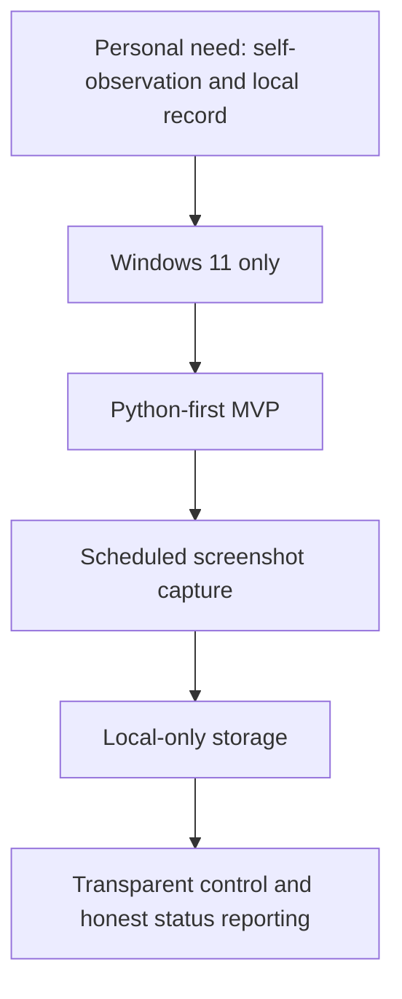

# SelfSnap Win11 — Customer Document Kit (Filled Example)

This package contains a **filled customer-side document set** for the current project:
**SelfSnap Win11**.

The goal of this pack is to show what a serious, reasonably disciplined customer submission can look like before a delivery team writes the PRD, SRS, architecture, privacy, QA, and release documents.

## Included documents

1. [01_Master_Customer_Questionnaire__START_HERE.md](01_Master_Customer_Questionnaire__START_HERE.md)
2. [02_Project_Charter.md](02_Project_Charter.md)
3. [03_Product_Brief.md](03_Product_Brief.md)
4. [04_Customer_Intake_Form.md](04_Customer_Intake_Form.md)
5. [05_Scope_Constraints_NonGoals.md](05_Scope_Constraints_NonGoals.md)
6. [06_Downstream_Document_Roadmap.md](06_Downstream_Document_Roadmap.md)
7. [07_Proposed_Next_Actions_For_Team.md](07_Proposed_Next_Actions_For_Team.md)

## Reading order

Read them in order.

The pack progresses from:
- raw intent,
- to project justification,
- to product shape,
- to operational detail,
- to protected scope boundaries.

## What this filled pack is trying to achieve

It does **not** try to fully design the system.

It tries to give a real team:
- enough clarity to understand the customer,
- enough boundaries to avoid chaos,
- enough open questions to challenge intelligently,
- enough specificity to draft the next real delivery documents.

## Snapshot of the current project

