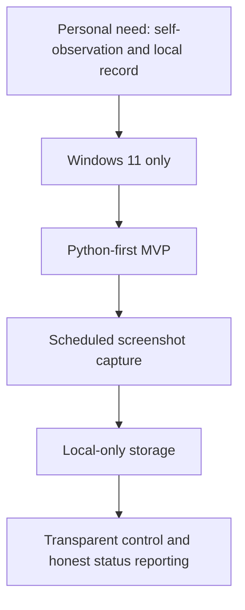

# SelfSnap Win11 — Customer Baseline Pack

[ARCHIVED REFERENCE]
This folder preserves the original customer-side intake pack that shaped SelfSnap.
It is not part of the active product or maintainer contract for the current HEAD.
Use [docs/README.md](../../README.md) first when you need current guidance.

## Navigation

- [../../../README.md](../../../README.md): top-level product overview and quick-start hub
- [../../README.md](../../README.md): full docs map
- [../README.md](../README.md): archive hub
- [../../developer/README.md](../../developer/README.md): current maintainer-doc hub

This package contains the original filled customer-side document set for **SelfSnap Win11**.

The goal of this pack is to show what a serious, reasonably disciplined customer submission can look like before a delivery team writes the PRD, SRS, architecture, privacy, QA, and release documents.

## Included Documents

1. [01_Questionnaire.md](01_Questionnaire.md)
2. [02_Project_Charter.md](02_Project_Charter.md)
3. [03_Product_Brief.md](03_Product_Brief.md)
4. [04_Intake_Form.md](04_Intake_Form.md)
5. [05_Scope.md](05_Scope.md)
6. [06_Roadmap.md](06_Roadmap.md)
7. [07_Next_Actions.md](07_Next_Actions.md)

## What This Pack Is For Now

Use this folder when you need to:
- reconstruct the original customer ask,
- compare the baseline request against the current maintained contract,
- trace how later product, architecture, validation, and release docs grew out of the intake material.

If you need the current maintained contract instead of the historical baseline, start with:
- [../../developer/product-requirements-document-v1.md](../../developer/product-requirements-document-v1.md)
- [../../developer/software-requirements-specification-and-architecture-v1.md](../../developer/software-requirements-specification-and-architecture-v1.md)
- [../../developer/validation-checklist.md](../../developer/validation-checklist.md)

## Reading Order

Read them in order.

The pack progresses from:
- raw intent,
- to project justification,
- to product shape,
- to operational detail,
- to protected scope boundaries.

## What This Filled Pack Is Trying To Achieve

It does **not** try to fully design the system.

It tries to give a real team:
- enough clarity to understand the customer,
- enough boundaries to avoid chaos,
- enough open questions to challenge intelligently,
- enough specificity to draft the next real delivery documents.

## Snapshot Of The Current Project

