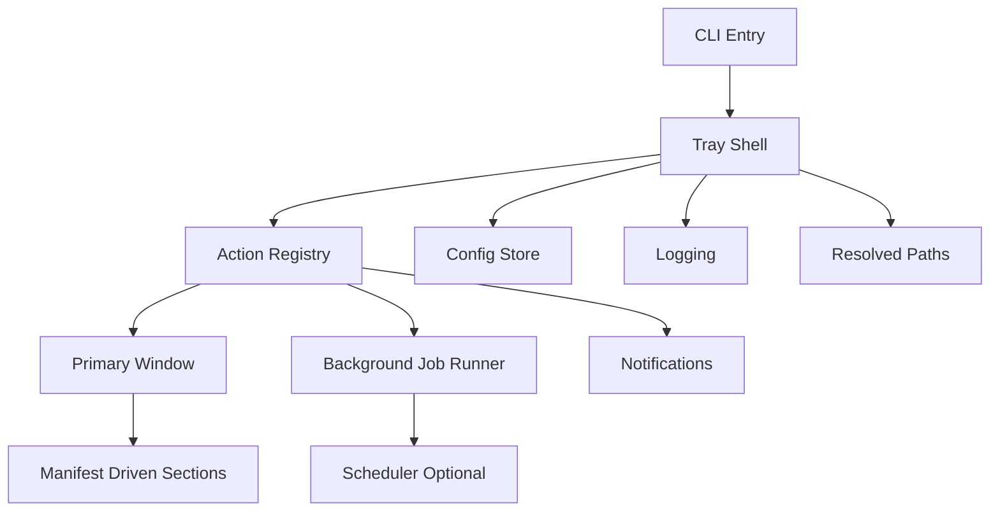

# Explanation: Target Architecture For A Reusable Tray App

[ARCHIVED STARTER KIT]
This file is part of the archived starter-kit pack preserved in [README.md](README.md).
It is reference material for reuse and extraction work, not the active SelfSnap product or maintainer contract.

SelfSnap already contains the bones of a strong Windows tray app. What it does not yet contain is a clean separation between tray infrastructure and screenshot product logic.

The extraction goal is not "make SelfSnap generic everywhere." The extraction goal is narrower and more practical:

- keep the Windows tray shell
- keep the local config and logging system
- keep the background launch and scheduler patterns
- replace the screenshot-specific windows and worker logic
- standardize on one primary window first

## Why a one-window starter is the right default

SelfSnap has several specialized windows because it is already a real product. A starter kit should bias toward speed, not completeness.

One primary window gives you four advantages:

1. Fewer files to rewrite on each new app
2. Fewer UI state transitions to debug
3. Easier manifest-driven generation later
4. A clearer place to add buttons, toggles, text blocks, links, and visual effects

Secondary windows should become optional add-ons, not the starting point.

## Recommended target shape

This is the architecture that makes rapid derivation realistic.

## The split that matters most

Today, `tray/app.py` mixes these concerns:

- tray lifecycle
- menu construction
- scheduler checks
- housekeeping
- dialog launching
- notification policy
- app-specific actions

That is acceptable for one app. It is expensive for a factory.

The starter should split that into:

- `tray/app.py` for the shell and event loop
- `action_registry.py` for what the menu and buttons can do
- `main_window.py` for the primary interface
- `job_runner.py` for background work
- `manifest.py` for starter configuration and UI composition

## What stays Windows-specific on purpose

This starter should stay opinionated about Windows.

Keep these assumptions:

- `pystray` for tray integration
- `tkinter` for a lightweight native-enough UI
- PowerShell scripts for install and uninstall flows
- Windows Task Scheduler for coarse recurring work
- `%LOCALAPPDATA%` as the app-data root

The point is not cross-platform purity. The point is fast, repeatable Windows delivery.

## How the intake form becomes software

The intake form is not just documentation. It is the contract for the future starter factory.

The form defines:

- what the primary window contains
- which actions exist
- which toggles persist
- which links appear
- whether recurring jobs exist
- which visual cues matter

That means the next step after this documentation is straightforward:

1. freeze the form fields
2. freeze a JSON manifest shape
3. map manifest fields to starter UI sections
4. automate repo copy, rename, and manifest injection

Once those four contracts are stable, mass project creation becomes realistic.

## What to standardize first

Standardize these before anything else:

- package and folder naming
- CLI baseline commands
- config keys
- tray menu order
- main window section order
- action naming
- background job result contract
- log and diagnostics shape

Everything else can vary by app.

## What to delay

Delay these until the starter is already usable:

- a custom widget library
- dynamic plug-in loading
- rich animation system
- multi-window navigation model
- code generation from prose without a manifest

Those ideas are valuable later, but they do not help you get to the first ten usable apps quickly.